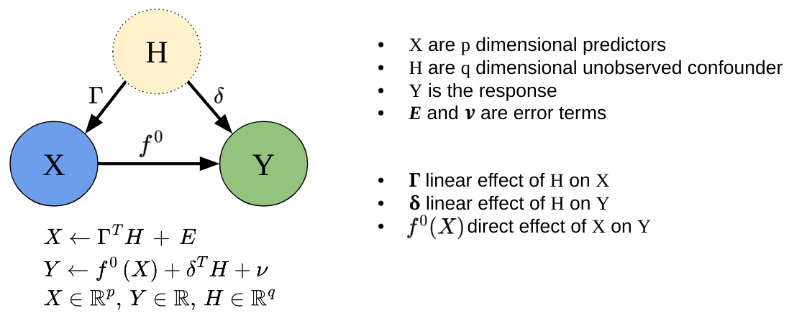

# SDModels

 [Spectrally Deconfounded Models (SDModels)](https://markusul.github.io/SDModels/) is a package with methods to
screen for and analyze non-linear sparse direct effects in the presence
of unobserved confounding using the spectral deconfounding techniques
(Ćevid, Bühlmann, and Meinshausen (2020), Guo, Ćevid, and Bühlmann
(2022)). These methods have been shown to be a good estimate for the
true direct effect if we observe many covariates, e.g., high-dimensional
settings, and we have fairly dense confounding. Even if the assumptions
are violated, it seems like there is not much to lose, and the SDModels
will, in general, estimate a function closer to the true one than
classical least squares optimization. SDModels provides software for
Spectrally Deconfounded Additive Models (SDAMs) (Scheidegger, Guo, and
Bühlmann (2025)) and Spectrally Deconfounded Random Forests
(SDForest)(Ulmer, Scheidegger, and Bühlmann (2025)).

