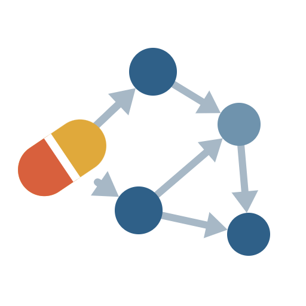
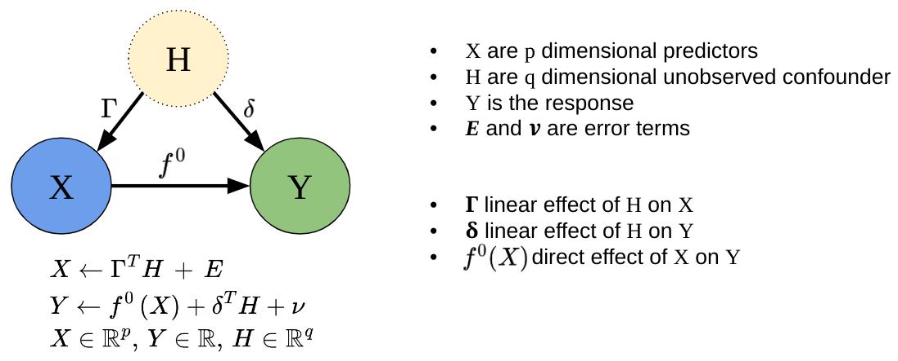

# Drug-Prot 

[Drug-Prot](https://ulme.shinyapps.io/DrugProt/) is an interactive R Shiny application
for querying statistical evidence of drug effects, drug–drug interactions, and
directed temporal protein dependencies in a large-scale perturbation proteomics dataset.
 
Drug-Prot lets you specify a set of proteins of interest and returns, for that set:
corrected p-values for the effect of each of 63 single drugs and 59 drug combinations
on protein expression at 6, 24, and 48 hours post-treatment; and a directed temporal
dependency network linking the queried proteins to any other protein in the dataset.
Because multiple-testing correction is applied only over the queried set, focused
analyses gain substantial power relative to proteome-wide searches.
 
All statistical evidence (approximately 60 million p-values across 5,392 proteins,
122 treatments, and three time points) is precomputed, so queries are near-instantaneous
and the underlying proteomic dataset is never needed at query time.

# SDModels 

 [Spectrally Deconfounded Models (SDModels)](https://markusul.github.io/SDModels/) is a package with methods to
screen for and analyze non-linear sparse direct effects in the presence
of unobserved confounding using the spectral deconfounding techniques
(Ćevid, Bühlmann, and Meinshausen (2020), Guo, Ćevid, and Bühlmann
(2022)). These methods have been shown to be a good estimate for the
true direct effect if we observe many covariates, e.g., high-dimensional
settings, and we have fairly dense confounding. Even if the assumptions
are violated, it seems like there is not much to lose, and the SDModels
will, in general, estimate a function closer to the true one than
classical least squares optimization. SDModels provides software for
Spectrally Deconfounded Additive Models (SDAMs) (Scheidegger, Guo, and
Bühlmann (2025)) and Spectrally Deconfounded Random Forests
(SDForest)(Ulmer, Scheidegger, and Bühlmann (2025)).

# Ancestor Regression 

[Ancestor Regression (AncReg)](https://markusul.github.io/AncReg/) is a package with methods to test for
ancestral connections in linear structural equation models (C.
Schultheiss and Bühlmann (2023)) and structural vector autoregressive
models (Christoph Schultheiss, Ulmer, and Bühlmann (2025)). Ancestor
Regression provides explicit error control for false causal discovery,
at least asymptotically. To have power, however, it relies on
non-Gaussian distributions.